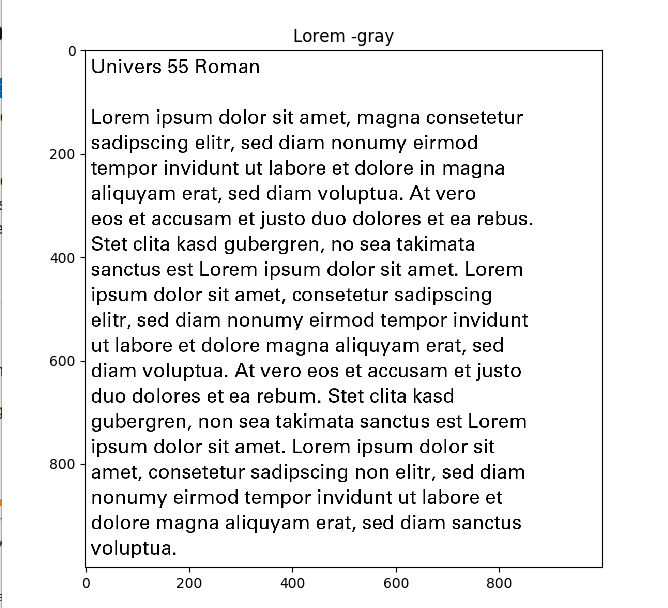
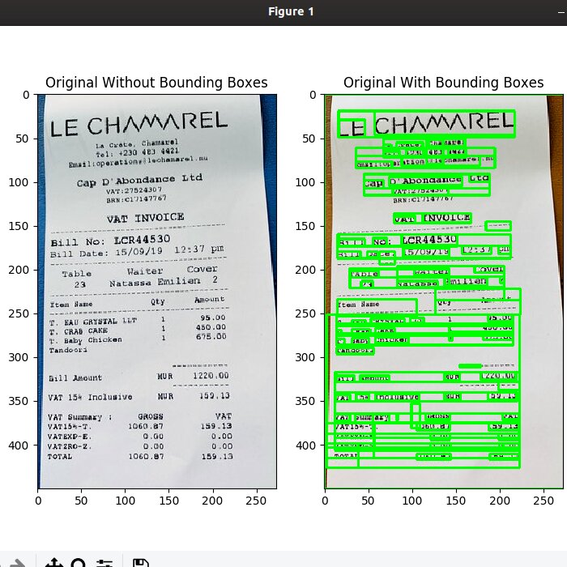
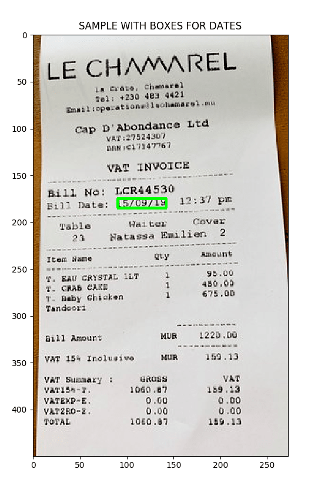

# Tesseract-OCR: 

Tesseract-OCR is an optical character recognition (OCR) tool for python. That is, it will recognize and "read" the text embedded in images.

Pytesseract is a wrapper for [Google's Tesseract-OCR Engine](https://github.com/tesseract-ocr/tesseract)
It is also useful as a stand-alone invocation script to tesseract, as it can read all image types
supported by the Pillow and Leptonica imaging libraries.

# Manual
    usage: ocr.py [-h] [-v] [-s SEARCH] file

    positional arguments:
    file                  path to image file you want to extract text from

    optional arguments:
    -h, --help            show this help message and exit
    -v, --view            Shows the boundaries around the text
    -s SEARCH, --search SEARCH
                            Search for the paticular Regular Expression in Image.

## Description
-----------
* **ocr.py**  generates and preprocess the image and produces the text as an output detected by Tesseract
<p>
    
</p>
The corresponding text produces by tesseract are:

```bash
Univers 55 Roman
Lorem ipsum dolor sit amet, magna consetetur
sadipscing elitr, sed diam nonumy eirmod
tempor invidunt ut labore et dolore in magna
aliquyam erat, sed diam voluptua. At vero
eos et accusam et justo duo dolores et ea rebus.
Stet clita kasd gubergren, no sea takimata
sanctus est Lorem ipsum dolor sit amet. Lorem
ipsum dolor sit amet, consetetur sadipscing
elitr, sed diam nonumy eirmod tempor invidunt
ut labore et dolore magna aliquyam erat, sed
diam voluptua. At vero eos et accusam et justo
duo dolores et ea rebum. Stet clita kasd
gubergren, non sea takimata sanctus est Lorem
ipsum dolor sit amet. Lorem ipsum dolor sit
amet, consetetur sadipscing non elitr, sed diam
nonumy eirmod tempor invidunt ut labore et
dolore magna aliquyam erat, sed diam sanctus
voluptua. 
```
* **bounding_box.py**  generates a box around the text generated by Tesseract
<p>
    
</p>

* **Searching.py** searches for a pattern like serching for dates and prices using regex expression and producing an corresponding boxes around that pattern
<p>
    
</p>

## Installation and Running for Demo
* Install all the Requirements from Requirement.txt file and run **ocr.py** for text recognition
* Run **bounding_box.py** for drawing bounding box around the text recognized by tesseract
* Run **Searching.py** for searching and drawing around the required text or expression by chossing suitable Regex

### Checkout [this link](https://www.pyimagesearch.com/2017/07/10/using-tesseract-ocr-python/) to learn more about Tesseract!!


